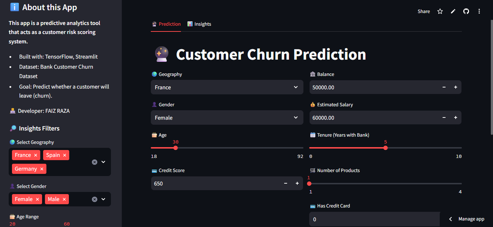

#🧠 Customer Churn Prediction with Deep Learning

A machine learning web app built with TensorFlow, Keras, and Streamlit to predict customer churn based on demographic and account information.

🚀 Features

✅ Trained Deep Learning Model (model.h5)

✅ Encoders for categorical features (.pkl files)

✅ User-friendly Streamlit Web App

✅ Deployed with GitHub + Streamlit Cloud

📂 Project Structure
📦 churn-prediction  
 ┣ 📜 app.py                 # Streamlit app  
 ┣ 📜 requirements.txt       # Python dependencies  
 ┣ 📜 runtime.txt            # Python runtime version  
 ┣ 📜 model.h5               # Trained model (via Git LFS)  
 ┣ 📜 label_encoder_gender.pkl  
 ┣ 📜 onehot_encoder_geo.pkl  
 ┣ 📜 scaler.pkl  
 ┣ 📜 Churn_Modelling.csv    # Dataset  
 ┣ 📜 README.md              # Documentation  

⚙️ Installation

Clone the repository:

git clone https://github.com/YOUR_USERNAME/churn-prediction.git
cd churn-prediction

Install dependencies:

pip install -r requirements.txt

Run the Streamlit app:

streamlit run app.py

🌐 Deployment

Easily deployable on Streamlit Cloud:

Push repo to GitHub.

Go to Streamlit Cloud
 → Create new app → Select repo.

Done 🎉

📸 Demo

👉 Add your app screenshot here:

🛠️ Tech Stack

Python 🐍

TensorFlow / Keras 🤖

Streamlit 🎨

GitHub + Git LFS 📂

👨‍💻 Author

Mohammed Faiz Raza Mulla
📧 Email: razafaiz003@gmail.com
🔗 LinkedIn | GitHub
